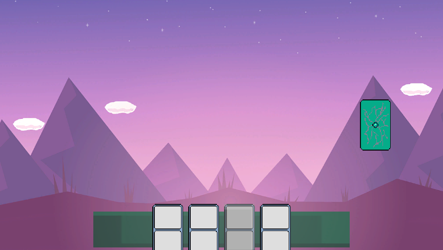
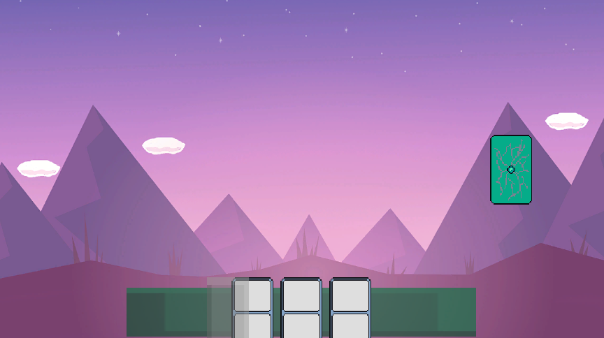

# 카드 컨트롤 UI
## UI 설명 요약
- `덱`을 누르면 `핸드`에 카드가 채워진다.
- `카드`를 드래그 후 `핸드` 영역 내에 드랍하면 원래 자리로 돌아간다.
- `카드`를 드래그 후 `핸드` 영역 밖에 드랍하면 `카드`가 사라진다.
- `핸드` 내 `카드`는 언제나 중앙 정렬된다.

## 게임 화면

- 우측 카드 뒷면이 `덱`이다.
- 하단 초록색 박스 영역이 `핸드` 영역이다.
- 핸드영역 좌측 반투명(회색) 카드는 카드 정렬을 위한 `가짜카드`이다. 실제로는 유저가 볼 수 없도록 투명해야하나, 어떻게 정렬되는지 볼 수 있도록 반투명하게 설정했다.

---

- `덱`을 누르면 `핸드`에 한 장의 `카드`가 채워진다.

---

- `핸드`에 `카드`는 4장까지만 채워질 수 있다.

---

- `카드`를 드래그 하는 도중 카드 정렬이 흐트러지지 않도록 `가짜카드`가 그 자리를 대신한다.

- `카드`를 `핸드` 위에 드랍하는 경우 본래자리로 돌아간다.

---

- `카드`를 `핸드`가 아닌 영역에 드랍하는 경우 `카드`는 사라진다.
- `핸드`에 `가짜카드`가 차지한 자리를 무시하고 3장의 `카드`가 가운데 정렬이 되는 모습을 볼 수 있다.

---

- `핸드`에 `카드`를 모두 털어낼 수 있다.